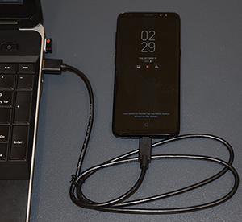
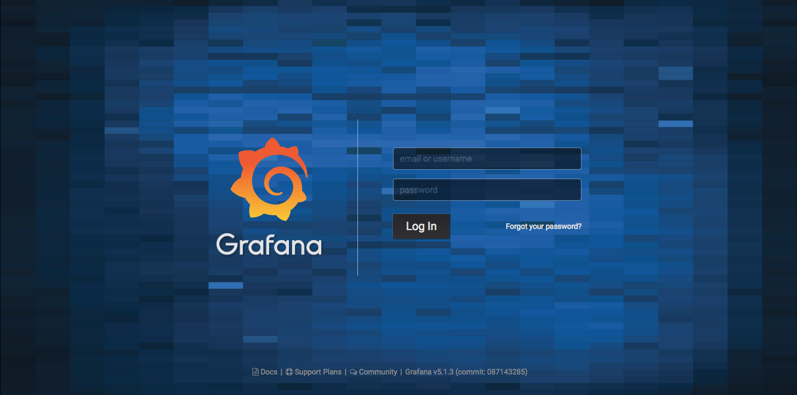
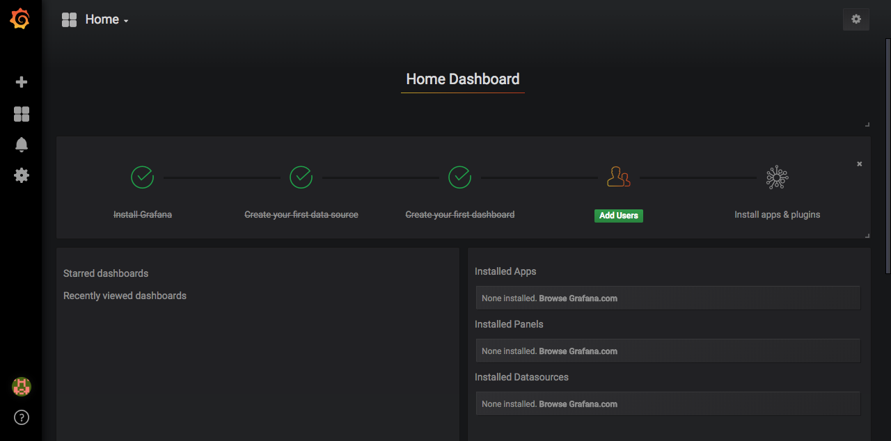
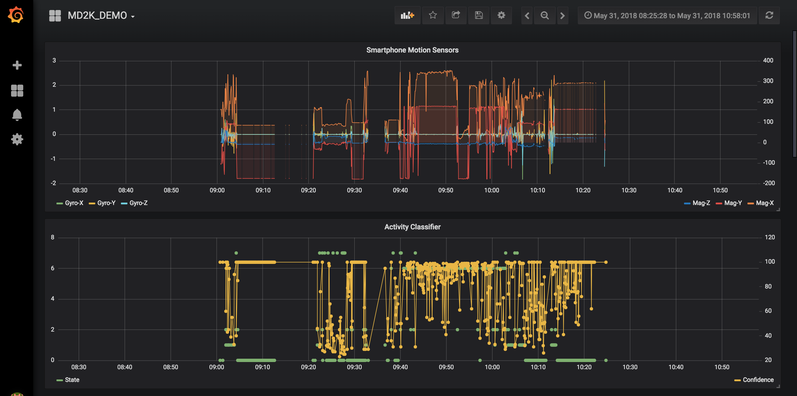
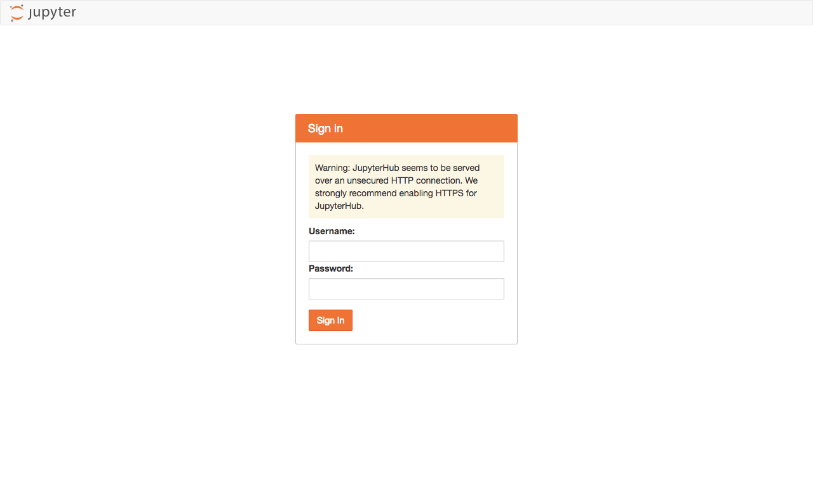
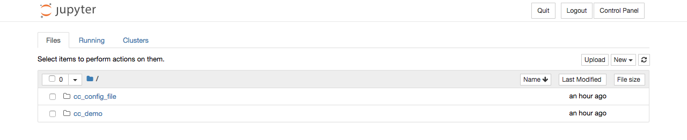
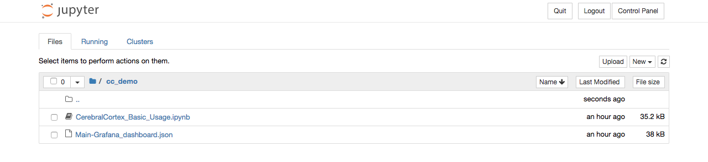
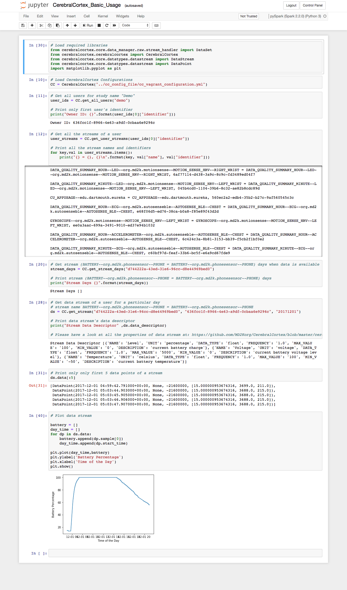

# Vagrant configuration for installing Cerebral Cortex
This repository is ideal for developers and engineers to install and evaluate the Cerebral Cortex platform.


# Disclaimer
This software is intended for informational and demonstration purposes only and is not designed to diagnose, treat, cure, prevent, or track disease or health states. No content provided in this software is intended to serve as a substitute for any kind of professional (e.g., medical) advice.

# Installation Instructions
The Cerebral Cortex platform can installed and tested on any of the three major platforms: Linux, Mac OS X, and Windows.  The following instructions will walk you through installing the dependencies necessary to run Cerebral Cortex.

## Linux: (Ubuntu 17.10)
These steps are preformed from the command line and do not need a graphical interface.

1. Install VirtualBox and Vagrant
  ```bash
  sudo apt install virtualbox virtualbox-dkms virtualbox-guest-additions-iso
  wget https://releases.hashicorp.com/vagrant/2.1.1/vagrant_2.1.1_x86_64.deb
  sudo dpkg -i vagrant_2.1.1_x86_64.deb
  ```

2. Install the docker-compose plugin for Vagrant

  ```bash
  vagrant plugin install vagrant-docker-compose
  vagrant plugin install vagrant-vbguest
  ```
  Please consult [Vagrant Documentation](https://www.vagrantup.com/docs/)  if you face any installation errors for step 1 and 2.

3. Clone this CerebralCortex-Vagrant repository.
  ```bash
  git clone https://github.com/MD2KOrg/CerebralCortex-Vagrant -b personal
  cd CerebralCortex-Vagrant
  vagrant up
  ```

## Mac OS X:
These steps are preformed from the command line with the support of [Homebrew](https://brew.sh/) and do not need a graphical interface.

1. Install VirtualBox and Vagrant
  ```bash
  brew cask install virtualbox
  brew cask install vagrant
  ```

2. Install the docker-compose plugin for Vagrant
  ```bash
  vagrant plugin install vagrant-docker-compose
  vagrant plugin install vagrant-vbguest
  ```
  Please consult [Vagrant Documentation](https://www.vagrantup.com/docs/)  if you face any installation errors for step 1 and 2.

3. Clone this CerebralCortex-Vagrant repository.
  ```bash
  git clone https://github.com/MD2KOrg/CerebralCortex-Vagrant -b personal
  cd CerebralCortex-Vagrant
  vagrant up
  ```

## Windows 7+:

1. Install VirtualBox and Vagrant
  - Download and install the Windows binary for VirtualBox: https://www.virtualbox.org/wiki/Downloads
  - Download and install the Windows binary for Vagrant: https://www.vagrantup.com/downloads.html

2. Download the CerebralCortex-Vagrant repository.  
    Download location: https://github.com/MD2Korg/CerebralCortex-Vagrant/archive/personal.zip

3. Extract the `CerebralCortex-Vagrant-personal.zip` file and open it in `Explorer`

4. Double click on the `cerebralcortex_initialize.cmd` file which will launch a command window and begin the installation of the Cerebral Cortex platform.

  Please consult [Vagrant Documentation](https://www.vagrantup.com/docs/)  if you face any installation errors for step 1 and 2.

5. **NOTE: For Windows installations, replace `vagrant_ssh` with double clicking on `cerebralcortex_console` in all remaining steps or running the subsequent commands in the command window.**

## Launch Cerebral Cortex
Open the following link to start utilizing Cerebral Cortex http://localhost:8080/


## Optional: Steps to Explore Underlying Services

Confirm that everything started up correctly. The following commands lists the the status of all the services used by CerebralCortex.  Docker-Compose commands can be used to
interact with Cerebral Cortex's containers.

```bash
vagrant ssh
cd CerebralCortex-DockerCompose/
docker-compose ps
```

The above commands display the status of all the services as shown below.
```
      Name                    Command               State                    Ports                   
 ---------------------------------------------------------------------------------------------------
 md2k-api-server   /entrypoint.sh /start.sh         Up      443/tcp, 80/tcp                          
 md2k-grafana      /run.sh                          Up      0.0.0.0:3000->3000/tcp                   
 md2k-influxdb     /entrypoint.sh influxd           Up      0.0.0.0:8086->8086/tcp                   
 md2k-jupyterhub   jupyterhub --no-ssl --conf ...   Up      0.0.0.0:32771->8000/tcp                  
 md2k-minio        /usr/bin/docker-entrypoint ...   Up      0.0.0.0:9000->9000/tcp                   
 md2k-mysql        docker-entrypoint.sh mysqld      Up      0.0.0.0:3306->3306/tcp                   
 md2k-nginx        nginx -g daemon off;             Up      0.0.0.0:443->443/tcp, 0.0.0.0:80->80/tcp
```


## Importing and Analyzing Your Data

### Downloading mCerebrum data to your computer

1. **Important**: You must first stop data collection before connecting the smartphone to a computer.

2. Connect the smartphone to a PC using the charging cable.

  

3. Using the computer, navigate to the phone’s org.md2k.mCerebrum folder. `Phone > Android > data > org.md2k.mCerebrum > files > 636fcc1f-8966-4e63-a9df-0cbaa6e9296c`

  

4. Copy all of the `*.gz` and `*.json` files in the folder and paste them to `PATH/TO/CerebralCortex-Vagrant-personal/vagrant_data/raw`

  

5. Disconnect the smartphone from the computer


### Importing and processing your data

#### Enable Google Places API (optional)

Some of the features that can be computed rely on the Google Places API and if you would like to include this optional capability, the following steps are required to configure this option.

1. Navigate to [developers.google.com](https://developers.google.com/) and sign in with a valid Google account.

2. Navigate to the places web-service `Get API Key` page https://developers.google.com/places/web-service/get-api-key

3. Follow the steps to `Get A Key` for the __standard Places API for Web__ option. By default, the key is good for 1000 queries/day and can be increased to 150k/day by verifying your identity with a credit card.

4. Run the following command to enable the location-aware features in the Cerebral Cortex pipeline.

  ```bash
  vagrant ssh
  enable_google_places.sh COPY_KEY_HERE
  ```

#### Import and analyze the data
Data can now be processed, which can take some time due to the CPU intensive nature of computing all the features and markers.

  ```bash
  vagrant ssh
  ingest_and_analyze.sh
  ```

A large number of console logs will appear on the screen indicating what the system is currently doing.  It will first preprocess the data files you copied from the mCerebrum app into a format that Cerebral Cortex will ingest.  Next, the ingestion pipeline will scan and import this data into Cerebral Cortex's internal data stores.  Finally, it will run a pre-specified set of feature computations based on the smartphone sensors streams.


# Visualizing and Analyzing Your Data
Cerebral Cortex provides two mechanisms to visualize and analyze your data.  First, a user-centric interface is provided by the [Grafana](https://grafana.com/) project which can be utilized to plot and explore Cerebral Cortex data streams.  Second, a code-centric interface is provided by the [Jupyter](http://jupyter.org/) project and allows a user to write Python3 code to interact with the Cerebral Cortex kernel.

## Visualization of data with Grafana
Open this link in your web browser http://localhost:8080/grafana/login to visualize your data.  

1. The default login and password are both `admin`.  

  


2. Once you authenticate, you will see the following screen.

  


3. Select the `Home` dropdown at the top left of the screen and choose the **MD2K_DEMO** dashboard.

  


This is a pre-built visualization that provides some examples of the various types of displays that are possible.  

For example, ... (TWH Complete this with data)
- Data Yield of MSHRV-LED, MSHRV-Accel, AutoSenseBLE
- Geolocation
- Phone/SMS/Notifications
- Phone screen touches

You may [create additional dashboards](http://docs.grafana.org/guides/getting_started/) to visualize all of the raw and processed data.


## Analyzing your data with Jupyter Notebooks
Open this link in your web browser http://localhost:8080/jupyterhub/hub/login to interact and analyze your data.  

1. A login screen will be shown as follows.  

  The username and password are both `md2k`.  The warning shown is because this site is running locally on your machine and is not secured by a security certificate.  There is no data leaving the machine and going across the internet.

  


2. A file browser will appear after successful authentication and you should choose the `cc_demo` folder.

  

  


3. Click on the `CerebralCortex_Basic_Usage.ipynb` and it will open in a new tab.  This provides an overview of how to utilize Cerebral Cortex and visualize some data.

  


This example notebook demonstrates the following:
  - Import CerebralCortex libraries and loading configurations
  - Get all users of a study
  - Get all streams of a user
  - Get days when a stream has data available
  - Get a stream's raw data and metadata
  - Plot stream raw data


### Creating your own scripts

  1. Authenticate with user credentials
  2. Click on Files tab
  3. Click on new and select `pySpark (Spark 2.2.0) (Python 3)` to create a new Python script.


## Computing features
The [CerebralCortex-DataAnalysis](https://github.com/MD2Korg/CerebralCortex-DataAnalysis) repository is available within the Vagrant virtual machine and is accessible through the Jupyter interface.  This repository contains the code to compute features on the data. These features are located in the `core/feature` directory.

The following features have been validated by our team and are considered stable with the remaining features still
under development. Please have a look at the documentation for each of the above features to get more insight into their functionality. Sensors/features in parentheses should be considered dependencies to compute the specified feature.

#### Stable Features
  * phone_features (Smartphone)
  * gpsfeature (Smartphone, gps, gps_daily)
  * puffmarker (MotionSenseHRV)
  * rr_interval (MotionSenseHRV)

#### Features Under Development
  * xxx
  * yyy


## Deleting Cerebral Cortex
Run following commands if anything goes wrong and/or you want to uninstall CerebralCortex vagrant image

```bash
vagrant destroy
```

## Starting and stopping Cerebral Cortex
Stop Cerebral Cortex
```bash
vagrant halt
```

Suspend Cerebral Cortex
```bash
vagrant suspend
```

Start Cerebral Cortex
```bash
vagrant up
```


## FAQ

1. **I'm stuck, where do I get help?**

  Please look for more information or ask for help here: https://discuss.md2k.org/


2. **System requirements**

  These are the minimum recommended system requirements for running Cerebral Cortex.
  - 2-4 core CPU
  - 16+ GB RAM
  - 10GB disk + enough to support the total data collection from mCerebrum


3. **Errors encountered during provisioning**

  Use `vagrant up --provision` to resume the installation.
